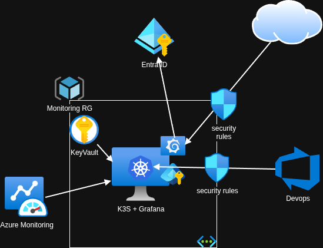

# CLAUDE.md — atomic-grafana

## Project Purpose

Lightweight Azure monitoring solution: a single Grafana instance on K3s, running on one Azure VM. Designed for small teams with no in-house Kubernetes expertise and a limited budget.

**Not a general-purpose Grafana deployment.** No HA, no multi-region, no Helm customization beyond what's in the manifests.

## Architecture Overview



```
Cloudflare (TLS edge)
    → Azure VM (Standard_B1ms, Ubuntu 24.04)
        → K3s
            → Traefik (ingress, HTTP→HTTPS redirect)
            → External Secrets Operator (syncs from Azure KeyVault)
            → Grafana (v10.3.0, Azure Monitor datasource)
```

Secrets flow: Azure KeyVault → External Secrets Operator → Kubernetes Secrets → Grafana env vars / admin credentials.

Authentication: Azure AD (Entra ID) OAuth — no local Grafana user accounts in production. The Entra ID application registration is a manual step not covered here; follow the [Grafana Entra ID guide](https://grafana.com/docs/grafana/latest/setup-grafana/configure-access/configure-authentication/entraid/).

## Tech Stack

| Layer | Tool |
|---|---|
| Infrastructure | Terraform (azurerm ~4.55.0) |
| Configuration | Ansible |
| Kubernetes | K3s |
| Secrets at rest | SOPS + Azure Key Vault |
| Secrets in cluster | External Secrets Operator v1.1.1 |
| Ingress | Traefik (K3s built-in) |
| Monitoring | Grafana 10.3.0 + Azure Monitor datasource |
| DNS/TLS | Cloudflare origin cert |

## Directory Structure

```
atomic-grafana/
├── main.tf                          # Azure infra: VM, VNet, NSG, Managed Identity, RBAC
├── playbook.yaml                    # Ansible: install K3s, copy manifests
├── manifests/
│   ├── 00-external-secrets.yaml    # Helm: External Secrets Operator
│   ├── 01-azure-store.yaml         # ClusterSecretStore → Azure KeyVault (Managed Identity)
│   ├── 02-tls-secrets.yaml         # ExternalSecret: Cloudflare origin cert
│   ├── 03-traefik-config.yaml      # HelmChartConfig: enable HTTPS, HTTP redirect
│   ├── 04-grafana.yaml             # Helm: Grafana deployment + ingress
│   ├── 05-grafana-secrets.yaml     # ExternalSecret: admin creds + OAuth secrets
│   └── 06-grafana-dashboards.yaml  # ConfigMap: embedded Azure dashboard JSON
├── secrets-management/
│   ├── .sops.yaml                  # SOPS key reference (Azure Key Vault)
│   ├── monitoring_secrets.enc.yaml # SOPS-encrypted secret values
│   └── secrets_management.tf       # Terraform: push decrypted secrets to KeyVault
└── images/
    └── atomic_grafana.png          # Architecture diagram
```

## Deployment

### Prerequisites

- Azure Resource Group (pre-existing)
- Azure Key Vault (pre-existing, with required secrets populated)
- SSH key pair available locally; `~/.ssh/config` configured with VM hostname and key
- Tools: `terraform`, `ansible`, `sops`
- Ansible inventory (`inventory.ini`) with VM hostname/IP

### Steps

```bash
# 1. Provision infrastructure
terraform apply -var-file="variables.tfvars"
# Outputs the public IP — update Cloudflare DNS and inventory.ini with it

# 2. Configure VM and deploy K3s + manifests
ansible-playbook -i ./inventory.ini ./playbook.yaml
# K3s auto-applies all manifests from /var/lib/rancher/k3s/server/manifests/
```

> The Ansible playbook can also target a **pre-existing VM** if you want to reuse underutilized infrastructure instead of provisioning a new one. Skip step 1 and point `inventory.ini` at the existing host.

### Secrets Setup (first-time only)

```bash
# Decrypt and push secrets to KeyVault via Terraform
cd secrets-management/
terraform apply
```

SOPS requires access to the Azure Key Vault key referenced in `.sops.yaml` to decrypt `monitoring_secrets.enc.yaml`.

> Secrets management here uses the **same SOPS-based pipeline** already in place for non-cloud-native workloads — it's not specific to this project. If that pipeline evolves, update `secrets_management.tf` accordingly.

## Key Design Decisions

- **Managed Identity, not service principals** — no key rotation, no credential leakage
- **External Secrets Operator** — K8s secrets sync from KeyVault on 1h interval; no hardcoded values in manifests
- **SOPS in Git** — secrets are encrypted before commit; decrypted only at deploy time
- **K3s over AKS** — avoids managed control plane cost (~$150/mo saved)
- **No persistent storage** — manifests are the source of truth; destroying and recreating the VM restores all config without backups
- **Hardcoded values in manifests are intentional** — K3s doesn't support kustomization, so values that rarely change (e.g. the public DNS record) are baked in directly
- **Cloudflare edge TLS** — origin cert stored in KeyVault; public TLS handled by Cloudflare proxy

## Azure KeyVault Secrets Expected

The following secrets must exist in KeyVault before deploying (see `secrets_management.tf` for names):

- Cloudflare origin TLS cert and key
- Grafana admin username and password
- Azure AD OAuth client ID, client secret, tenant ID

## Modifying Dashboards

Dashboards live in `manifests/06-grafana-dashboards.yaml` as an embedded JSON ConfigMap. To update:
1. Export the dashboard JSON from Grafana UI
2. Replace the JSON in the ConfigMap
3. Re-run the Ansible playbook or apply the manifest directly with `kubectl apply`

## Limitations (by design)

- Single VM — no HA, no failover
- Azure-only — not portable without significant rework
- Manual GitOps — manifests are copied by Ansible, not synced by ArgoCD
- Fixed Grafana version — update `04-grafana.yaml` HelmChart version to upgrade
