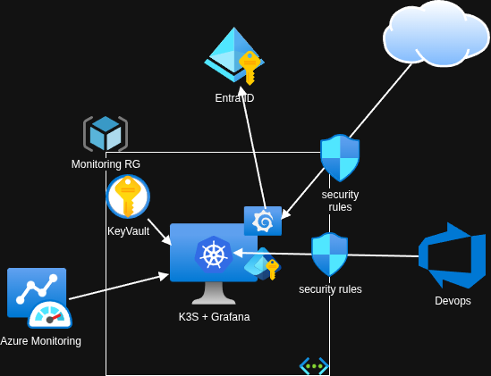

## Atomic Grafana
## Lightweight Azure Monitoring Proxy Dashboard (K3s)

## Overview
I needed an automated monitoring solution for a client with zero in-house cloud expertise and a limited operating budget.  
The goal was to provide a professional-grade Grafana dashboard to monitor Azure infrastructure without the overhead or cost of a managed Kubernetes cluster (AKS).
At the same time, security aspects could not be overlooked.

## Challenges
The client required visibility into their infrastructure (Azure VMs, Network metrics) with the following constraints:
* A managed Kubernetes cluster (AKS/EKS) control plane + worker nodes was cost-prohibitive for a single dashboard application.
* The client has no DevOps engineers. The solution needs to be low maintenance.
* The client needs to be able to monitor on-prem workloads in the future

## Solution
I architected a "Kubernetes patterns on a shoestring" solution. By using K3s (Lightweight Kubernetes) on a single Azure VM, I can get the power of Kubernetes manifests, Helm charts, and declarative configuration, but with the footprint of a micro-instance.

## Why this exists
Atomic Grafana is an attempt to treat observability tooling as a composable platform primitive rather than a one-off deployment.

## Non-goals
* Solving every Grafana deployment pattern
* High Availability deployment
* Supporting complex Helm workflows

## Architecture Highlights:

* **Infrastructure**: Terraform provisions a single Standard_B1ms Azure VM, Networking and security groups.
* **Secrets** are managed by a different pipeline, but using SOPS as the source of truth.  Since there's already a pipeline that does this for workloads that are not cloud native.
* **Configuration Management**: Ansible installs K3s and copies manifests to the K3s auto-deploy directory.
* **Security**: Zero hardcoded credentials. Secrets are pulled from Azure KeyVault via the External Secrets Operator (K8s).
* **Access**: Federated OAuth login via Azure AD (Entra ID) and Cloudflare for Edge TLS.

## Stack

* **Compute**: Azure VM (Ubuntu 24.04), K3s
* **IaC**: Terraform (Infra), Ansible (Config), SOPS (Secrets)
* **Observability**: Grafana (Helm), Azure Monitor
* **Security**: Azure KeyVault, External Secrets Operator, Managed Identity
* **Networking**: Traefik Ingress, Cloudflare

## Terraform
The VM uses a System Assigned Managed Identity to securely talk to Azure APIs without rotating service principal keys.

* **Managed Identity**: Used for both fetching secrets from KeyVault and reading metrics from Azure Monitor.
* **Network Security**: Strict NSGs allow only SSH from specific management IPs, while exposing HTTP/HTTPS for web traffic.

Given a public key from the keypair that'll be used to manage the VM via ssh and a pre-existing resource group.

[main.tf](main.tf)

## Ansible
Once the VM is up, `~/.ssh/config` setup with host names and keys, the [ansible playbook](./playbook.yaml) can run

```bash
ansible-playbook -i ./inventory.ini ./playbook.yaml
```

> [!NOTE]
> This pattern assumes the availability of a pre-existing virtual machine, allowing small teams to reuse underutilized infrastructure. The trade-off between full end-to-end provisioning and faster Helm-based deployment is intentional.

## Manifests
There a few kubernetes [manifests](./manifests/) that will be automatically applied after they are copied to the K3s VM.  Some of the configuration needs to be hardcoded as K3s lacks of kustomization.  These are values that will hardly change, like the public DNS record chosen for the dashboards.

* [External Secrets](./manifests/00-external-secrets.yaml) - [Details here](https://external-secrets.io/latest/)
* [SSL/TLS Certificate](./manifests/02-tls-secrets.yaml) - Using [CloudFlare](https://developers.cloudflare.com/ssl/origin-configuration/origin-ca/) in proxy mode for it to handle the public cert
* [Traefik Config](./manifests/03-traefik-config.yaml) to handle https redirections
* [Grafana](./manifests/04-grafana.yaml) and [Grafana Secrets](./manifests/05-grafana-secrets.yaml) - [Grafana config docs ](https://grafana.com/docs/grafana/latest/setup-grafana/configure-grafana/) - *Note*: I followed [these steps](https://grafana.com/docs/grafana/latest/setup-grafana/configure-access/configure-authentication/entraid/) to create the application in Entra ID.  It's not included in this document.
* And an example of how a [dashboard](./manifests/06-grafana-dashboards.yaml) can be imported from a configmap - The goal is not to have persistent data.  Destroying and recreating the VM with the scripts will bring back all of the config without the need of backups.

## Secrets Management

The example is [here](./secrets-management/secrets_management.tf).
[SOPS](https://github.com/getsops/sops) is awesome.

## Basic Diagram

